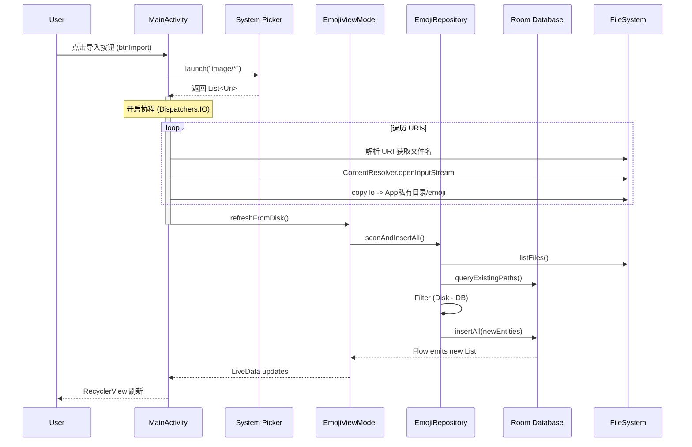

# 内部交接文档: Emoji Gallery Project (EmojiMaster)

**文档版本**: 1.0.0
**项目代号**: EmojiMaster (Package: `com.example.localshare`)
**编写人**: Android 架构师
**日期**: 2025-12-09

-----

## 1\. 环境搭建与构建 (Environment & Build)

### 1.1 技术栈概览

* **Language**: Kotlin
* **Min SDK**: API 24
* **Architecture**: MVVM (Model-View-ViewModel)
* **UI Toolkit**: View System (XML) + ViewBinding
* **Async**: Coroutines + Flow + LiveData
* **DI**: 手动注入 (Manual Injection via `AppDatabase.getInstance`)

### 1.2 关键依赖库

* **Jetpack Room**: 数据库 ORM (`androidx.room:*`)
* **Glide**: 图片加载与缓存 (`com.github.bumptech.glide:glide`)
* **Lifecycle**: ViewModel & LiveData (`androidx.lifecycle:*`)
* **StdLib**: Standard IO (`java.io.File`)

### 1.3 权限与存储策略 (Scoped Storage)

本项目严格遵守 **Android 10+ 分区存储 (Scoped Storage)** 规范，**无需**申请 `READ_EXTERNAL_STORAGE` 或 `WRITE_EXTERNAL_STORAGE` 权限。

* **读取/导入**: 使用 `ActivityResultContracts.OpenMultipleDocuments()` 调用系统文件选择器 (SAF)。应用仅获得用户所选文件的临时 URI 读取权限。
* **持久化存储**: 图片被复制到 **App-Specific Directory** (`Context.getExternalFilesDir(Environment.DIRECTORY_PICTURES)/emoji`)。此目录应用拥有完全读写权限，且随应用卸载而删除。

-----

## 2\. 项目架构 (Project Architecture)

### 2.1 目录结构

```text
com.example.localshare
├── data                 <-- 数据层
│   ├── AppDatabase.kt   # Room Database 单例
│   ├── EmojiDao.kt      # Data Access Object
│   ├── EmojiEntity.kt   # 数据库表定义
│   └── EmojiRepository.kt # 数据源仲裁 (Disk vs DB)
├── ui                   <-- 表现层
│   ├── EmojiAdapter.kt  # RecyclerView 适配器
│   ├── EmojiViewModel.kt# 状态持有与业务逻辑
│   └── PreviewActivity.kt # 大图预览
├── MainActivity.kt      # 入口与列表展示
└── databinding          # (Generated) ViewBinding 类

res
└── layout
    ├── activity_main.xml  # 主界面布局
    ├── activity_preview.xml # 预览界面布局
    └── item_emoji.xml     # 列表项布局
```

### 2.2 数据流向图

遵循单向数据流 (Unidirectional Data Flow) 原则：

`DB/Disk` -\> `DAO` -\> `Repository (Flow)` -\> `ViewModel (LiveData)` -\> `Activity (Observer)` -\> `RecyclerView`

-----

## 3\. 数据库设计 (Database Schema)

基于 **Room** 实现，数据库名为 `"emoji_db"`。

### 表结构: `emoji` (`EmojiEntity`)

| 字段名 | 类型 | 约束 | 说明 |
| :--- | :--- | :--- | :--- |
| `id` | Long | PK, AutoGen | 主键 |
| `file_path` | String | **Unique Index** | 图片绝对路径，用于去重 |
| `desc` | String? | Nullable | 图片描述 (文件名去除后缀) |

**设计决策**:

* `file_path` 设置了唯一索引 (`indices = [Index(value = ["file_path"], unique = true)]`)。这防止了同一物理文件在数据库中产生多条记录，是数据一致性的关键保障。

-----

## 4\. 核心功能实现 (Core Implementation)

### 4.1 图片列表展示 (Grid System)

* **Layout**: `MainActivity` 使用 `ConstraintLayout` 嵌套 `RecyclerView`。
* **LayoutManager**: `GridLayoutManager` (SpanCount = 4)。
* **Item Layout**: `item_emoji.xml` 使用 `FrameLayout` 包裹 `ImageView`。
    * **关键属性**: `android:layout_height="100dp"` 固定高度，`android:scaleType="centerCrop"`。
    * **性能考量**: 固定高度配合 `setHasFixedSize(true)` 可显著减少 RecyclerView 测量阶段的计算开销。
* **Image Loading**: Adapter 中使用 `Glide`。
    * 策略: `DiskCacheStrategy.ALL` (缓存原图和缩略图)，`dontAnimate()` (防止列表快速滑动时的闪烁)。

### 4.2 批量导入机制 (Import Mechanism)

这是应用最复杂的业务逻辑，涉及跨进程 URI 读取和本地 IO。

**流程图 (Sequence Diagram)**:



**逻辑注解**:

1.  **文件复制**: 在 `MainActivity.importEmojis` 中直接进行了 IO 操作（将流写入文件）。若文件名冲突，检查MD5若重复则跳过，不重复则覆盖。
2.  **双重同步**: `refreshFromDisk` 触发 Repository 扫描磁盘文件，并与 DB 数据比对，仅插入数据库中不存在的文件路径。

### 4.3 大图预览

* **触发**: 点击列表项 -\> `Intent` 携带 `file_path` -\> `PreviewActivity`。
* **UI**: `activity_preview.xml` 使用全屏 `ImageView`，背景纯黑 (`#000`)。
* **显示模式**: `scaleType="fitCenter"` 确保图片完整显示且不变形。

-----

## 5\. 已知问题与架构债 (Known Issues & Tech Debt)

作为接手人，你需要关注以下潜在风险和优化点：

### 5.1 架构违规 (High Priority)

* **View 层泄露逻辑**: `MainActivity` 中包含了大量文件 IO 操作 (`ContentResolver`, `File.outputStream`)。
    * *建议*: 将 `importEmojis` 中的 `Stream Copy` 逻辑下沉至 `EmojiRepository` 或专门的 `UseCase` 类中。Activity 仅应负责 UI 交互和 URI 传递。

### 5.2 性能瓶颈

* **主线程阻塞风险**: 虽然使用了 `Dispatchers.IO`，但 `scanAndInsertAll` 会一次性读取整个目录的文件列表 (`listFiles`)。当图片数量 \> 1000 时，文件系统的遍历可能会变慢。
* **全量加载**: `EmojiDao.getAll()` 返回 `List<EmojiEntity>`，这意味着所有元数据都加载到内存中。
    * *建议*: 引入 **Jetpack Paging 3**，将返回值改为 `PagingSource<Int, EmojiEntity>`，实现按需加载。

### 5.3 UI 适配

* **硬编码尺寸**: `item_emoji.xml` 中高度写死为 `100dp`。在不同 DPI 或宽屏设备上，4列布局可能导致图片比例失调或留白过多。
    * *建议*: 在 Adapter 中动态计算 Item 宽高，或使用 `ConstraintLayout` 的 `layout_constraintDimensionRatio="1:1"` 保持正方形。

### 5.4 导入稳定性

* **文件完整性**: 采用MD5校验，确保导入文件未损坏。

-----

**下一步行动**:
建议优先重构 `MainActivity.kt` 中的 `importEmojis` 方法，将其逻辑移入 `EmojiViewModel`，以确保 UI 层代码的纯净性。